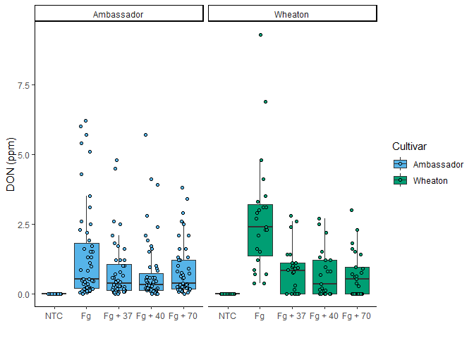

\` \## [Git
link](https://github.com/mzb0226/PLPA-6820/blob/main/Coding%20Challenge4/Challagne4.md)

## **YAML header**

The YAML (Yet Another Markup Language) header is a metadata block at the
beginning of an R Markdown (.Rmd) document. It defines settings for the
document, such as the title, author, output format, and table of
contents. It is enclosed in triple dashes (—). Example: title:
“CodingChallenge4” author: “Muhtarin Khayer Brohee” date: “2025-02-27”
output: md\_document: variant: gfm html\_document: default
pdf\_document: default word\_document: default toc: true

## **Literate programming**

Literate programming is an approach where code and natural language
explanations are combined in a single document. The goal is to create a
human-readable and reproducible document that integrates analysis with
documentation.

How does R Markdown support literate programming? - Code chunks
(\``{r}`) allow embedding of executable R code. - Markdown text enables
writing explanations, interpretation, and formatting. - Knit output
produces reports in HTML, PDF, or Word, making them easy to share.

[Article Link](https://pubmed.ncbi.nlm.nih.gov/34587775/)

    DON_data <- read.csv("MycotoxinData.csv", na.strings = "na")
    str(DON_data)

    ## 'data.frame':    375 obs. of  6 variables:
    ##  $ Treatment     : chr  "Fg" "Fg" "Fg" "Fg" ...
    ##  $ Cultivar      : chr  "Wheaton" "Wheaton" "Wheaton" "Wheaton" ...
    ##  $ BioRep        : int  2 2 2 2 2 2 2 2 2 3 ...
    ##  $ MassperSeed_mg: num  10.29 12.8 2.85 6.5 10.18 ...
    ##  $ DON           : num  107.3 32.6 416 211.9 124 ...
    ##  $ X15ADON       : num  3 0.85 3.5 3.1 4.8 3.3 6.9 2.9 2.1 0.71 ...

    # Print column names to check for typos or formatting issues
    print(colnames(DON_data))

    ## [1] "Treatment"      "Cultivar"       "BioRep"         "MassperSeed_mg"
    ## [5] "DON"            "X15ADON"

    # Show the first few rows of the dataset
    head(DON_data)

    ##   Treatment Cultivar BioRep MassperSeed_mg   DON X15ADON
    ## 1        Fg  Wheaton      2      10.291304 107.3    3.00
    ## 2        Fg  Wheaton      2      12.803226  32.6    0.85
    ## 3        Fg  Wheaton      2       2.846667 416.0    3.50
    ## 4        Fg  Wheaton      2       6.500000 211.9    3.10
    ## 5        Fg  Wheaton      2      10.179167 124.0    4.80
    ## 6        Fg  Wheaton      2      12.044444  73.1    3.30

    # Check the structure of the data
    str(DON_data)

    ## 'data.frame':    375 obs. of  6 variables:
    ##  $ Treatment     : chr  "Fg" "Fg" "Fg" "Fg" ...
    ##  $ Cultivar      : chr  "Wheaton" "Wheaton" "Wheaton" "Wheaton" ...
    ##  $ BioRep        : int  2 2 2 2 2 2 2 2 2 3 ...
    ##  $ MassperSeed_mg: num  10.29 12.8 2.85 6.5 10.18 ...
    ##  $ DON           : num  107.3 32.6 416 211.9 124 ...
    ##  $ X15ADON       : num  3 0.85 3.5 3.1 4.8 3.3 6.9 2.9 2.1 0.71 ...

## **Plot**

    cbbPalette <- c("#000000", "#E69F00", "#56B4E9", "#009E73", "#F0E442", "#0072B2", "#D55E00", "#CC79A7")

    DON_plot <- ggplot(DON_data, aes(x = Treatment, y = DON, fill = Cultivar)) +
      geom_boxplot(outliers = T, outlier.shape = 15) +
      ylab("DON (ppm)") +
      xlab("") +
      geom_jitter(pch = 21, position = position_jitterdodge(), color = "black", alpha = 0.6) + 
      scale_fill_manual(values = c(cbbPalette[[3]], cbbPalette[[4]])) +
      theme_classic() +
      facet_wrap(~Cultivar)
    DON_plot

    DON_data$Treatment <- factor(DON_data$Treatment, levels = c("NTC", "Fg", "Fg + 37", "Fg + 40", "Fg + 70"))

    DON_15 <- ggplot(DON_data, aes(x = Treatment, y = X15ADON, fill = Cultivar)) +
      geom_boxplot(outliers = F) +
      ylab("DON (ppm)") +
      xlab("") +
      geom_jitter(pch = 21, position = position_jitterdodge(), color = "black") + 
      scale_fill_manual(values = c(cbbPalette[[3]], cbbPalette[[4]])) +
      theme_classic() +
      facet_wrap(~Cultivar)
    DON_15

    seedmass <- ggplot(DON_data, aes(x = Treatment, y = MassperSeed_mg, fill = Cultivar)) +
      geom_boxplot(outliers = F) +
      ylab("DON (ppm)") +
      xlab("") +
      geom_jitter(pch = 21, position = position_jitterdodge(), color = "black") + 
      scale_fill_manual(values = c(cbbPalette[[3]], cbbPalette[[4]])) +
      theme_classic() +
      facet_wrap(~Cultivar)
    seedmass

### **Combined plot**

    ggarrange(DON_plot, DON_15, seedmass, labels = "auto", ncol = 3, nrow = 1, common.legend = T)

## **Statistical comparison**

    stats_donplot <- DON_plot + 
      geom_pwc(aes(group = Treatment), method = "t_test", label = "{p.adj.format}{p.adj.signif}", p.adjust.method = "fdr")

    stats_DON_15 <- DON_15 + 
      geom_pwc(aes(group = Treatment), method = "t_test", label = "{p.adj.format}{p.adj.signif}", p.adjust.method = "fdr")

    stats_seedmass <- seedmass + 
      geom_pwc(aes(group = Treatment), method = "t_test", label = "{p.adj.format}{p.adj.signif}", p.adjust.method = "fdr")

## **File Tree**

    fs::dir_tree()

    ## .
    ## ├── Challagne4.docx
    ## ├── Challagne4.md
    ## ├── Challagne4.Rmd
    ## ├── Challagne4.tex
    ## ├── Challagne4_files
    ## │   ├── figure-gfm
    ## │   │   ├── combined_plot-1.png
    ## │   │   ├── data_plot-1.png
    ## │   │   ├── data_plot-2.png
    ## │   │   └── data_plot-3.png
    ## │   ├── figure-html
    ## │   └── figure-markdown_strict
    ## │       ├── combined_plot-1.png
    ## │       ├── data_plot-1.png
    ## │       ├── data_plot-2.png
    ## │       └── data_plot-3.png
    ## ├── Colingchallenge4.R
    ## ├── MycotoxinData.csv
    ## └── read.md
